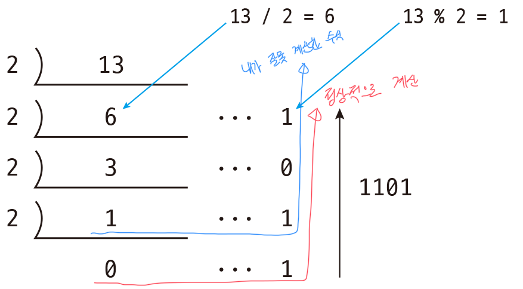
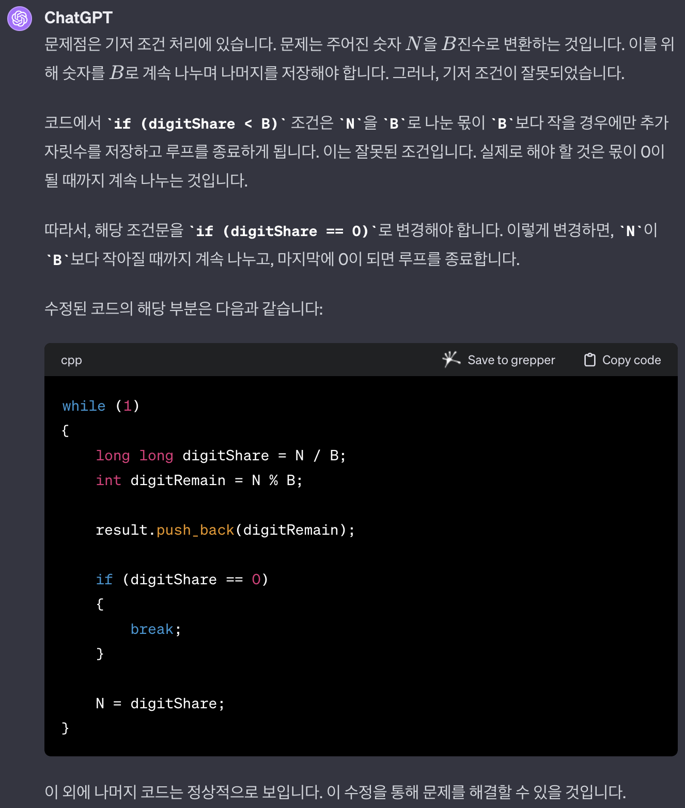

## 문제

https://www.acmicpc.net/problem/11005

`1시간 6분` 소요

## 풀이

[2745-진법 변환](../2745-진법%20변환/README.md) 와 쌍둥이 문제입니다.

`10진수` 에서 변환하고 싶은 진수로 계속 나눈 `나머지 값` 을 이어 붙이면 되는 문제입니다.  
`10진수` 를 `2진수` 으로 변환될 때 사용되는 `나눗셈 수식` 을 생각하면 됩니다.  
`10진수` 에서 `2진수` 로 변환할 때는 항상 `2` 라서 `2` 만 가능한 것인가 싶었지만 여기서 `2` 는 `10진수` 에서 바꾸고 싶은 `진수` 인 것입니다.
그렇기 때문에 나눠지는 수는 변환하고 싶은 `진수` 가 될 것입니다.

## 실수한 부분

### `0` 이 될 때 까지 나누지 않은 것

나는 `몫` 이 `진수` 보다 작으면 나눌 수 없기 때문에 더 이상 진행해도 의미가 없다고 생각했다.

그래서 코드로 표현하면 아래와 같았다.

```cpp
if (나눈 몫 < 진수)
{
    result.push_back(나눈 몫);
    break;
}
```

하지만 나눌 수 없어서 `몫` 은 의미가 없을지 몰라도 `나머지 값` 은 의미가 있는 값이었다.

그래서 맞는 코드는 아래와 같다.

```cpp
if (나눈 몫 == 0)
{
    break;
}
```

참고로 `몫` 이 `진수` 보다 작으면 나눌 수 없는 수식으로 하더라도 `백준` 풀이에서 약 `80%` 까지는 정상적으로 체크가 되기도했고 왠만한 값을 넣어도 대부분 맞아서 수식에는 문제가 없고 `자료형` 에 문제가 있다고 생각을 했는데 내가 처음에 틀린 수식도 대부분의 경우는 맞을 수도 있는 수식이여서 그랬던 것이다.

10진수 `13` 을 2진수로 변환하는 코드가 예시이다.  
이와 같이 어정정하게 맞는 수식이여서 찾는데 더 어려움이 있었다.



그리고 확실하게 안되는 경우는 10진수 `2` 를 10진수로 변환하는 코드이다.  
10진수의 값을 그대로 10진수로 바꾸는 것인데 내가 이전에 잘못 생각한 대로 하면 계산이 되지 않는다.

이래도 이해가 안된다면 `0` 이 될 때까지 나눠야 하는 것이 `공식` 이고  
이유는 나눌 수 없더라도 `나머지 값` 은 의미가 있기 때문이라고 `이해` 하도록 한다.

## 참고


