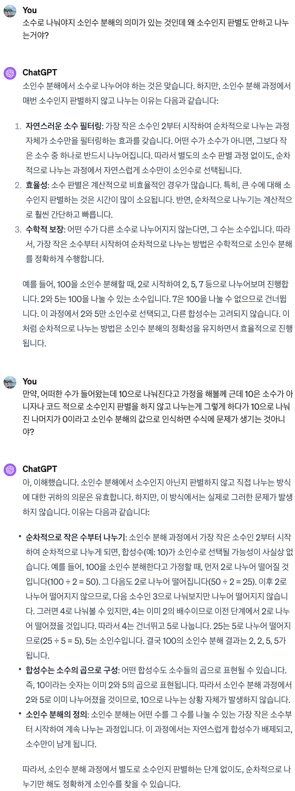

## 문제

https://www.acmicpc.net/problem/11653

`1시간 10분` 소요

## 실수

### 소인수 분해 후 N에 대해 값을 `빼는` 것이 아니라 나눠진 `몫` 을 넣는 것이었음

### 소인수 분해의 완료 조건은 `N` 이 `0` 인 경우가 아니라 `1` 인 경우임

### 소인수 분해를 위해서는 `소수` 만 나눠야 하기 때문에 매번 `소수` 를 구한 뒤 나누는 코드도록 코드를 작성했는데 시간 초과가 발생함

아래의 코드와 같이 `소인수 분해` 전 `소수` 인지 판별 후 `소인수 분해` 를 하도록 했는데 시간 초과가 발생함

```cpp
#include <iostream>
#include <set>
#include <vector>

using namespace std;

int main()
{
    ios_base::sync_with_stdio(false);
    cin.tie(nullptr);

    long long N;

    cin >> N;

    vector<int> 소인수분해;
    for (int 소수 = 2;; 소수++)
    {
        // 해당 부분
        set<int> 약수;
        for (int num = 소수; num >= 1; num--)
        {
            if (소수 % num == 0)
            {
                약수.insert(소수 / num);
            }
        }

        if (약수.size() == 2)
        {
            while (N % 소수 == 0)
            {
                소인수분해.push_back(소수);
                N /= 소수;
            }
        }

        if (N == 1)
        {
            break;
        }
    }

    for (auto v : 소인수분해)
    {
        cout << v << "\n";
    }

    return 0;
}
```

다른 사람들의 풀이를 보니까 `소수` 인지 판별하지 않고 `소인수 분해` 를 진행하길래 이해가 안되서 찾아보았는데



결론적으로 `가장 작은 소수` 부터 `소인수 분해` 를 수행하면 `나눠진 소수` 와 관련된 `배수` 들은 모두 나눠지므로 자연스럽게 이후에 `소수` 가 아닌 수가 등장하지 않는 것입니다.

그래서 제가 기존에 작성한 코드에서 소수를 구하는 부분을 제거해서 `시간 초과` 를 해결했습니다.
